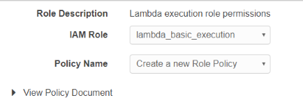
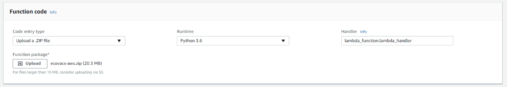
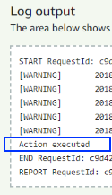

# Ecovacs AWS
Ecovacs API usage in AWS Lambda


## Summary
This is a short list of instructions to be able to use the Ecovacs API to control your vacuum cleaner within an AWS Lambda function. Use the provided source files to get started easily.


## Prerequisites
1. Python must be installed (don't forget to add it to your Path Variable)  
    [https://www.python.org/downloads/](https://www.python.org/downloads/)
2. Get access to your own AWS Account  
    [https://aws.amazon.com](https://aws.amazon.com)
3. Get your command line / PowerShell ready
4. Take your time to get through the instructions carefully


## Getting started
There is a great Github repository called "[sucks](https://github.com/wpietri/sucks)" which offers a wrapper for the Ecovacs API. Unfortunatelly AWS Lambda is not able to run the package out of the box (see "sucks-Modifications" chapter).
Therefore we have to make some modifications. Before we do that you should install "[sucks](https://github.com/wpietri/sucks)" and try out the command line possibilities.


## Preparing packaging for AWS Lambda
To run not available python packages in an AWS Lambda function you can package your dependencies into one zip file and run all the code you want.   
More details can be found on the AWS documentation page: https://docs.aws.amazon.com/lambda/latest/dg/lambda-python-how-to-create-deployment-package.html

To install sucks for deployment we create a new folder:
```powershell
mkdir ecovacs-aws
```

Afterwards we install sucks via pip into that folder (change your folder path accordingly):
```powershell
pip install sucks -t C:\Temp\ecovacs-aws
```

Now you should end up with all python packages within your defined folder to be able to test locally.


## Local tests
Create a new python file (e.g. ecovacs-test.py) for testing the API. Add the [sample source](/src/ecovacs-test.py) to your local file. Replace the configuration with your values and you are ready to go.

Execute the file:
```powershell
python .\ecovacs-test.py
```

Your robot should start cleaning now and you see the text "Action executed" in your command line.


## sucks-Modifications
So far so good, the API is working and you can control your robot.
Nevertheless I had some issues which requires modifications to get it running properly.

1. The script never ends  
    The script keeps running after it has started the robot successfully. That seems to be caused by a Ping which is queued every few seconds in the sucks source code. 

    ```python
    # From the original sucks code
    self.xmpp.schedule('Ping', 30, lambda: self.xmpp.send_ping(self._vacuum_address()), repeat=True)
    ```

    To avoid the execution of that line of code I've started the connection without the wrapped sucks connect function. Unfortunetelly I ran into timeout issues when using the xmpp connect function directly. To avoid those issues I've added a manual timeout.  
    After applying the change for the connection which is shown in [another sample file](/src/ecovacs-test-improved.py), the script should end properly.


2. Crypto not working in AWS Lambda  
    Using the sucks package out of the box doesn't work in AWS Lambda functions. An error occurs that there is a problem with the crypto module:

    ```"Cannot load native module 'Crypto.Cipher._raw_ecb': Trying '_raw_ecb.cpython-36m-x86_64-linux-gnu.so': /var/task/Crypto/Util/../Cipher/_raw_ecb.cpython-36m-x86_64-linux-gnu.so: cannot open shared object file: No such file or directory, Trying '_raw_ecb.abi3.so': /var/task/Crypto/Util/../Cipher/_raw_ecb.abi3.so: cannot open shared object file: No such file or directory, Trying '_raw_ecb.so': ```

    To avoid that we need to work around the usage of the Crypto module. Luckily it's only used for hashing the username and password for the transfer.  
    We have to go into the sucks folder in our source directory and edit the "_\_init__.py" file.

    We change the usage of self.ecrypt according to the following images.  
    Currently it should look like this on line 36:
      
    We change the usage of self.encrypt to that:  
      

    Before we can continue to use our source in an AWS Lambda function we have to hash the necessary variables locally.  
    Adding these two lines to your [test file](/src/ecovacs-test-crypto.py) gives you the required values.
    ```python
    print(EcoVacsAPI.encrypt(config["email"]))
    print(EcoVacsAPI.encrypt(config["password_hash"]))
    ```

    Execute the test script again and use the values from the output to fill it into these two lines. These lines should replace the previously added ones in your [test file](/src/ecovacs-test-aws.py).
    ```python
    config["email"] = "***"
    config["password_hash"] = "***"
    ```

    Now we are ready for AWS Lambda functions.


## Creating AWS Lambda function
* Open the AWS Console https://console.aws.amazon.com/
* Search Lambda and select Lambda
* Click "Create Function" > "Author from Scratch"
* Enter a Name (e.g. ecovacs-aws)
* As Runtime select "Python 3.6"
* In the Role section, select "Create a custom role"
    * IAM Role: lambda_basic_execution
    * Policy Name: Create a new Role Policy
    * Allow  
      
* You will be redirected back to Author from scratch
    * Role: should be set to Choose an existing role
    * Existing Role: lambda_basic_execution
* Create function

We are almost there...

* Change the timeout in the basic settings from 3 seconds to 10 seconds due to the really bad Ecovacs API performance.
* Copy your local test file & name it lambda_function.py
    * Wrap your [source code](/src/lambda_function.py) into a function block
* Create a zip file, so that all packages and source files are in the root level of the zip file
* Upload zip file to AWS (and Save it): 
    
* Create an empty test and execute it
    If it is successful, you should see the well known "Action executed in your log"  
    


## Final steps
* Getting rid of the hard coded variables.
    * Create AWS lambda function environment variables
    * Use them in your python code
        ```python
        import os
        os.environ['VARIABLE_NAME']
        ```
* Use different input parameter to control your Ecovacs


## Donation  
If you like my work, please consider buying me a coffee
<link href="https://fonts.googleapis.com/css?family=Cookie" rel="stylesheet"><a class="bmc-button" target="_blank" href="https://www.buymeacoffee.com/bamminger"><span style="margin-left:5px">Buy me a coffee</span></a>
